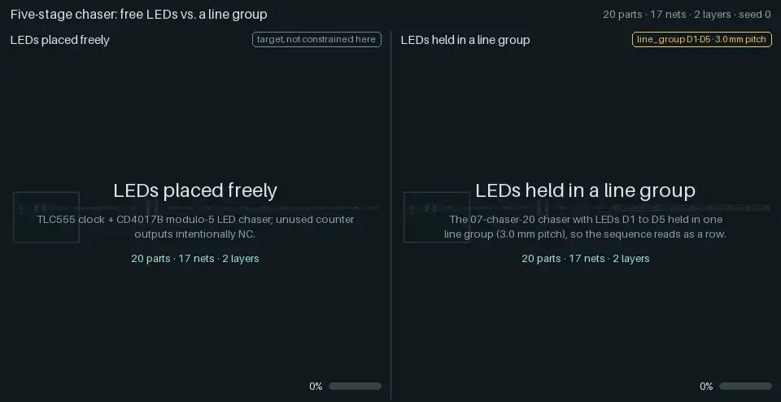
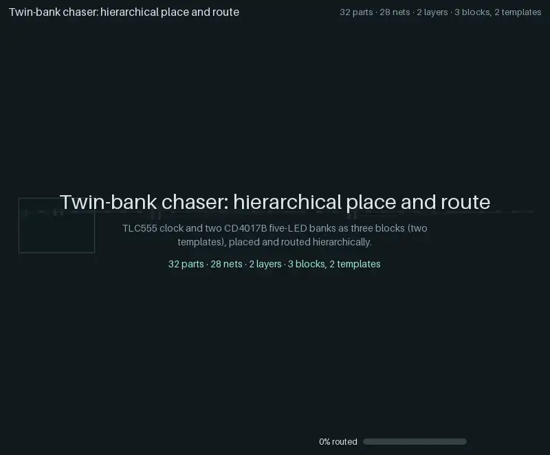

# Constraints and hierarchy

Three showcases of how yapnr handles what a human would ask of a layout: a row of LEDs that
reads as a row, connectors and buttons on the board edge, and a board built from reusable
blocks. Each animation is recorded engine state, like the [regression ladder](regression-ladder.md)'s:
global placement snapshots, the legalizer's order, every net the router commits, the saved KiCad
boards and KiCad's verdict.

> Figures in this page's tables are from the engine version named in each section and
> predate the ladder-v2 default-profile flip (`docs/decisions.md`): legacy fab profile,
> `--compact --gloss` passed explicitly. Re-running today's `--no-fab-profile` default
> (`jlc-pofv`) changes copper/via counts the same way it does on the public ladder
> (see [regression-ladder.md](regression-ladder.md#the-cases)); the pass/fail verdicts
> are unaffected.

The showcase cases (`designs.showcases()` in
[`hardware/pnr/regression/designs.py`][designs]) run through the ladder's runner and its gate, but
they are not ladder cases: they sit outside the ladder's gate and its pull-request lane (the
nightly lane runs them for information). All five cases below come from one traced run: seed 0,
a placement snapshot every 5 iterations, the engine's own JLCPCB fabrication profile, KiCad
10.0.6 on the development Mac (darwin-arm64), engine `f362d1e6`, with the runner's own defaults
since ladder-v2 (`docs/decisions.md`): [compact placement](design/compact-placement.md)
(`--compact`, `PNR_COMPACT=1`) and the [gloss pass](design/gloss.md) (`--gloss`, `PNR_GLOSS=1`).
The four flat cases use the initial placement pool (8 starts, 3 routed finalists, also the
default); the hierarchical case uses its own block trials and four top-level seeds. Every case
passes the gate: 100 % routed, no open connections and no findings in KiCad's DRC. Each
animation ends with the gloss stage's before and after (the copper it replaces in red, its new
copper in green; see
[Reading an animation](regression-ladder.md#reading-an-animation)).

## Line groups

<p></p>

The five-stage chaser (`07-chaser-20`: a TLC555 clocking a CD4017B that drives five LEDs) twice,
on the same board, with the same seed and budgets. On the left the LEDs are free; on the right,
`line-chaser-20` holds D1 to D5 in one line group, the only difference:

```yaml
line_group:
  - name: chaser_leds
    members: [D1, D2, D3, D4, D5] # in order along the line
    pitch_mm: 3.0 # centre to centre
    rot: 90 # each LED's rotation in the line's frame
    reason: Chaser LEDs in one row, so the sequence reads as a line
```

A line group is a hard constraint. The placer sees it as one rigid part (a macro: the members'
courtyards and pads in the line's frame), so global placement moves and turns the whole line and
the legalizer places it in one step; afterwards the members are posed from the line's pose.

What to watch:

- **Global placement:** the dashed rectangle is the rigid line. It slides as one body while the
  other parts gather around it. The placer's rotation is a four-way choice: here it turns the
  line upright within the first five iterations and keeps it there (the engine records only the
  chosen direction, never the angles in between; a half-turn would be drawn as a flip).
- **Legalization:** the line, with its five series resistors beside the LEDs, is placed in one
  step, not ten (11 steps instead of 20).
- **The pool's shortlist:** the eight starts put the line in different places and directions
  (vertical in six starts, horizontal in two, both ways round).
- **The caption strips:** HPWL (the half-perimeter wirelength of every net, from the frame's
  poses) and the "LED line error", the largest distance of D1 to D5 from their best-fit line. On
  the left the dashed path through D1 to D5 shows where the sequence goes; its error ends at
  6.45 mm. On the right it is 0.00 mm throughout.

| Case             | Parts | Routed | Opens | Findings | Vias | Copper (mm) | HPWL (mm) | Time (s) |
| ---------------- | ----: | :----: | ----: | -------: | ---: | ----------: | --------: | -------: |
| `07-chaser-20`   |    20 | 100 %  |     0 |        0 |   13 |      220.85 |       185 |     47.5 |
| `line-chaser-20` |    20 | 100 %  |     0 |        0 |    9 |      209.18 |       154 |     35.2 |

Here the line board ends shorter: 31 mm less HPWL, 11.7 mm less copper and four vias fewer than the
free one (one seed: the two boards come from different placements, so the difference is not the
line's own price). Caveats: a line turned by 180° reverses the sequence on the board, which a human
would accept either way, so the placer may choose either direction (near the end of global
placement its choice can flip between the two).

Each LED's series resistor rides in the line with it: compact placement's `SATELLITES` part
(`PNR_LINE_SATELLITES`, [design](design/compact-placement.md), section 11) adds to a line group
every free two-pad part joined to one member pad by a two-pin net, flush beside that member and in
line with it, so the placer moves and turns LED and resistor rows as one body. Wirelength alone
cannot put a resistor there (anywhere on the path from its driver pin to its LED it has the same
wirelength). Without compact placement the resistors stay free.

## Board edges

<p></p>

A "hold to blink" board (a TLC555 astable that runs while pushbutton SW1 is held), twice. On the
right, `edge-io-12` holds the supply connector J1, the button SW1 and the LED D1 on the south
edge, each turned so that its long axis runs along the edge; the order along the edge is left to
the placer. On the left, `edge-io-12-free` drops those constraints. Nothing else is fixed.

```yaml
edge_align:
  J1: { edge: south, hard: true, tolerance_mm: 1.0 }
  SW1: { edge: south, hard: true, tolerance_mm: 1.0 }
  D1: { edge: south, hard: true, tolerance_mm: 1.0 }
orientation: # the facing is set by the orientation constraint
  J1: 90
  SW1: 0
  D1: 0
```

`edge_align` pulls a part towards its edge during global placement. With `hard: true` the
legalizer also keeps it within `tolerance_mm` of the edge, and the legality checks and feedback
moves respect it.

What to watch:

- **Tethers:** a line from each held part to the edge, red while it is farther than its
  tolerance, mint once it is within it. During global placement the pull is soft, so parts
  approach the edge; the legalizer's band then holds them there.
- **The order along the edge:** the caption strip reads it live ("south: J1 · SW1 · D1"). In the
  start the animation follows, D1 and SW1 pass each other as the parts approach the edge, and the
  order ends J1, SW1, D1. The order changes in other starts, so the shortlist first replays
  the global placement of all eight starts side by side (recorded snapshots, one clock), with each
  tile's order under it: in four starts two edge parts pass each other during global placement
  (in one of them twice), and in five the legalizer changes the order (it picks each
  part's slot with its wirelength). The tiles then hold each start's legalized order: two
  different orders among the eight.
- **The free board:** the dashed edge is the other board's target, drawn for reference; "on edge
  0 of 3" counts its parts within 1 mm of it. Its parts stay on the board throughout the start it
  follows (in another start of its pool, nine leave it during global placement).

| Case              | Parts | Routed | Opens | Findings | Vias | Copper (mm) | HPWL (mm) | Time (s) |
| ----------------- | ----: | :----: | ----: | -------: | ---: | ----------: | --------: | -------: |
| `edge-io-12-free` |    12 | 100 %  |     0 |        0 |    5 |      109.38 |        95 |     31.2 |
| `edge-io-12`      |    12 | 100 %  |     0 |        0 |    6 |      122.89 |        97 |     32.7 |

Here the held board ends longer: 2 mm more HPWL, 13.5 mm more copper and one more via than the free
one (one seed: the two boards come from different placements, so the difference is not the
constraint's own price).

## Regions and alignments

Two more relations a designer asks for: keep a subsystem in one area of the board, and line
parts up on one coordinate. Both are hard by default (a soft variant is a weighted penalty) and
take any refs, globs or `@addresses`:

```yaml
region: # the clock parts' courtyards stay in the west half of the 42 x 32 mm board
  - name: clock
    refs: [U1, R1, R2, C1, C2, C3]
    rect: [0, 0, 21, 32] # or polygon: [[x, y], ...], or areas: [...] (a union)
align: # the two ICs' origins on one horizontal line
  - name: ics
    refs: [U1, U2]
    axis: y
    anchor: origin # or centre, pad1, pad:<name>, a courtyard edge; or {ref: anchor}
    tol_mm: 0.25
```

A part is measured by its body: its courtyard widened to its pads and silkscreen, where it really
lies about the footprint origin, so a pin header measured from pin 1 or a connector with an
offset shell is not padded out to a box centred on its origin.

How each stage treats them:

- **Before placement:** a hard region or align that no placement can meet is refused by name,
  for example a fixed part outside its region, or members whose regions keep their anchors
  apart.
- **Initial pool:** the starts move into the outline, into the regions and onto the lines.
- **Global placement:** a region term (the squared distance of each body corner from the area,
  in expectation over the part's rotation distribution) and an alignment term (the squared
  deviation of each expected anchor from the members' mean).
- **Legalizer:** it bounds each slot centre. A rectangle region is a box per tried rotation, and
  a polygon or union a raster mask whose grid lines are the pieces' own edges. An align is the
  band the members already placed leave, narrowed to where the others can still reach. The
  aligned members are placed as one block, and a slot that leaves a later member no room is
  backtracked. An align whose `tol_mm` is under that band, such as 0, then has its members
  moved onto one exact line wherever that stays legal.
- **Later moves:** the legality checks, and with them every feedback move, relocation, the side
  pass's flips and swaps and the Monte-Carlo search, reject a hard violation. A member of a line
  group or a hierarchical block carries its region and its anchor inside the rigid macro.
- **Double-sided boards** (`board.sides: double`): a part is measured on the side it is tried
  on, its pads, anchors and body mirrored on the bottom. That holds for the legalizer's
  other-side slot, a start drawn on the bottom, and global placement, which mixes both sides by
  each free part's side probability, as it does for the pins.
- **Soft variants:** a soft region or align is a cost in global placement, the legalizer (both
  sides' slots), relocation (moves, flips and swaps), the side pass, batch relocation, the
  elastic mesh and the feedback children. The native loop tries a move that grows it last.
- **Not supported:** `PNR_POWER_FIRST=1` refuses a design with either constraint.

The [input reference](hardware/pnr-inputs.md) lists the keys of both sections.

The ladder's constraint rungs (`hardware/pnr/regression/hard_rungs.py`, `run.py --hard`) use
both: `07-chaser-20-abs` confines the clock to the west half, `07-chaser-20-rel` aligns the
timer and the counter, and the MCU board's rungs do the same with its regulator and its two
buttons. The independent checker (`check_constraints.py`) measures them on the saved KiCad
board, as it does for every other tool.

Before the engine took them, the boards it routed for these rungs broke them: the clock sat 7 to
20 mm outside the west half, and the two ICs were 6.4 and 10.1 mm off one line. Now every check
holds on both seeds (the initial pool: eight starts, three routed finalists), with DRC-clean
boards:

| Case               | Seed | Checks | Vias | Copper (mm) | HPWL (mm) | CPU (s) | Before: checks, vias, copper |
| ------------------ | ---: | -----: | ---: | ----------: | --------: | ------: | ---------------------------- |
| `07-chaser-20-abs` |    0 |  19/19 |   22 |       358.3 |       290 |     283 | 18/19, 18, 336.2             |
| `07-chaser-20-abs` |    1 |  19/19 |   26 |       417.6 |       308 |     761 | 18/19, 24, 346.9             |
| `07-chaser-20-rel` |    0 |    8/8 |   20 |       338.9 |       293 |     111 | 7/8, 15, 358.0               |
| `07-chaser-20-rel` |    1 |    8/8 |   18 |       337.7 |       272 |     163 | 7/8, 18, 332.6               |

The clock in the west half costs 22 and 71 mm of copper and two to four vias: its six parts
share that half with the connector and a mounting hole, and their nets reach across to the
counter. The alignment's own cost shows in runs from the unchanged source start: 19 and 5 mm
more copper, and 9 and 0 more vias. The table also includes the initial pool's outline fit,
which brings a source board staged outside the outline inside it, keeping the parts' order,
before the starts are projected. On seed 0 the fit took the aligned board from 377 back to
339 mm, so that gain belongs to the fit, not to the alignment.

The fit runs where a region or an align is declared; `PNR_FIT_OUTLINE=1` runs it for every
design (for the engine directly; the ladder runner strips ambient `PNR_` switches). On the old
gate's source boards it lowers the source start's HPWL by up to 149 mm. It changes the routed
finalists, or the source start among them, on 13 of 16 cases, so turning it on everywhere waits
for a re-baselined gate.

The MCU board's rungs satisfy the regulator's region and the buttons' alignment on both seeds,
and on every legal start of the pool. That board does not yet route completely, with or
without them.

## Hierarchical place and route

<p></p>

`hier-twin-bank-32`: a TLC555 clock driving two identical CD4017B banks of five LEDs, 32 parts on
a 56 × 40 mm board. Each part carries an atopile-style address (`top.clock.u`,
`top.bank_a.r0`, ...), from which the engine derives three blocks and two templates: the two
banks share one template. Only VCC, GND and CLOCK cross block boundaries.

What to watch:

1. **Blocks.** Each template is placed and routed on its own board, in sixteen trials (two seeds
   on each of eight outlines: four sizes, each wide and tall; compact placement adds the two
   denser sizes); the tiles replay each template's chosen trial side by side, at one scale. The
   bank template's trials follow with their rank (opens, port debt, area, vias, copper), and both
   banks reuse the chosen layout, the densest size here: one layout, two instances.
2. **Top level.** The blocks become rigid macros (their outline is dashed) and move onto the
   board; the top-level placer places them like parts, moving a whole block with its copper and
   flipping it end for end (the placer records a block only at 0° or 180° here; a half-turn is
   drawn as a flip), and legalizes one macro per step.
3. **Knitting.** The block copper is kept as it is (drawn dimmed): the progress bar starts at the
   50 of 60 connections the blocks already make. The router adds the nets between blocks, the
   connector and the bulk capacitor (full colour). Four top-level seeds were knitted; their
   montage follows, then KiCad's writeback, planes, zone refill and verdict.

| Case                | Parts | Routed | Opens | Findings | Vias | Copper (mm) | HPWL (mm) | Time (s) |
| ------------------- | ----: | :----: | ----: | -------: | ---: | ----------: | --------: | -------: |
| `hier-twin-bank-32` |    32 | 100 %  |     0 |        0 |   34 |      458.85 |       320 |     83.7 |

## What is interpolated

Every frame is either recorded engine state or a labelled transition between two recorded
states:

- **Placement snapshots.** Positions between two recorded global placement snapshots are
  interpolated linearly, as in the ladder's animations.
- **Rigid bodies.** A line group or a block macro moves as one: its centre is interpolated
  linearly and its angle along the shorter arc between two snapshots, and its members are posed
  from that pose (never one by one, which would shrink a line mid-turn). A half-turn has no
  shorter arc, and the placer records only its snapped four-way choice, so a body (or, in these
  animations, a single part) recorded at opposite angles flips at the middle of the interval: a
  half-turn is shown as a flip, not a rotation.
- **The camera.** When recorded poses leave the board during global placement, the camera
  widens over all of that placement's snapshots and zooms back to the board after legalization.
- **The pool replay (board edges).** The shortlist's tiles replay each start's recorded global
  placement snapshots on one clock, then show its legalized placement in one step.
- **The lift ("Blocks become macros", 0.8 s).** The blocks move from their display layout to
  their first recorded macro poses; the connector and the bulk capacitor fly in from the unplaced
  row. The display layout before it (the blocks side by side, without the board) is a
  presentation, not a placement.
- **Comparisons.** The two halves are synchronized scene by scene; the shorter half holds its last
  frame of a scene until the other catches up.
- **The gloss stage.** The saved boards before and after it cross-fade; the red (replaced) and
  green (new) copper is the geometric difference between those two boards.

Nothing else is invented: no easing of the engine's order, no reordering, no copper the engine
did not commit. The caption metrics (HPWL, LED line error, parts on their edge and their order)
are computed from the poses on screen.

## Regenerating

The showcase run needs what the ladder needs (a numerical Python, KiCad 10 with its Python module
and footprint library; see [Regression ladder](regression-ladder.md#regenerating)). The
hierarchical case takes about two minutes on the development Mac.

```sh
# 1. The showcase run (07-chaser-20 and the four showcase cases); the output must not exist.
#    --compact --gloss: the runner's own defaults since ladder-v2 (docs/decisions.md).
"$NUMERIC_PYTHON" hardware/pnr/regression/run.py --repo . --out .yapnr/ladder/SHOWCASES \
  --seed 0 --trace --trace-placement-every 5 --initial-pool --initial-starts 8 \
  --initial-finalists 3 --timeout 1200 --showcases --compact --gloss \
  --case 07-chaser-20 --case line-chaser-20 --case edge-io-12-free --case edge-io-12 \
  --case hier-twin-bank-32 \
  --python "$NUMERIC_PYTHON" --kicad-python "$PNR_KICAD_PYTHON" \
  --kicad-cli "$PNR_KICAD_CLI" --library "$PNR_KICAD_FOOTPRINTS"

# 2. Render the four files into docs/animations/ and their manifest and results entries.
bazel run //hardware/pnr:showcase_animations -- --render-only "$PWD/.yapnr/ladder/SHOWCASES"
```

One comparison of any two traced runs renders with
`bazel run //hardware/pnr:animate -- --compare LEFT RIGHT --out FILE.webp --labels A B` (a trace,
a case directory or `RUN_DIR:CASE` each; `--replay-pool` replays the pool's starts in the
shortlist, as the board-edge file does); a hierarchical case directory renders like any other
case (`--pacing showcase` gives placement and routing more time). Budgets: 2.5 MB per WebP (the
hierarchical one 3.5 MB), 5 MB per GIF, 30 MB for `docs/animations/` in all
(`tests/unit/repo/test_animations.py`). The provenance of each file (the run's engine commit,
`sources_sha256`, trace and content hashes) is in the `showcases` entries of
<a href="animations/manifest.json"><code>animations/manifest.json</code></a>, and the cases'
results in the `showcases` array of
<a href="animations/ladder-results.json"><code>animations/ladder-results.json</code></a>. The
design is [Design: line groups, board edges and hierarchical PnR, animated][design].

[designs]: https://github.com/Studio-Fug/yapnr/blob/main/hardware/pnr/regression/designs.py
[design]: design/constraint-and-hier-animations.md
