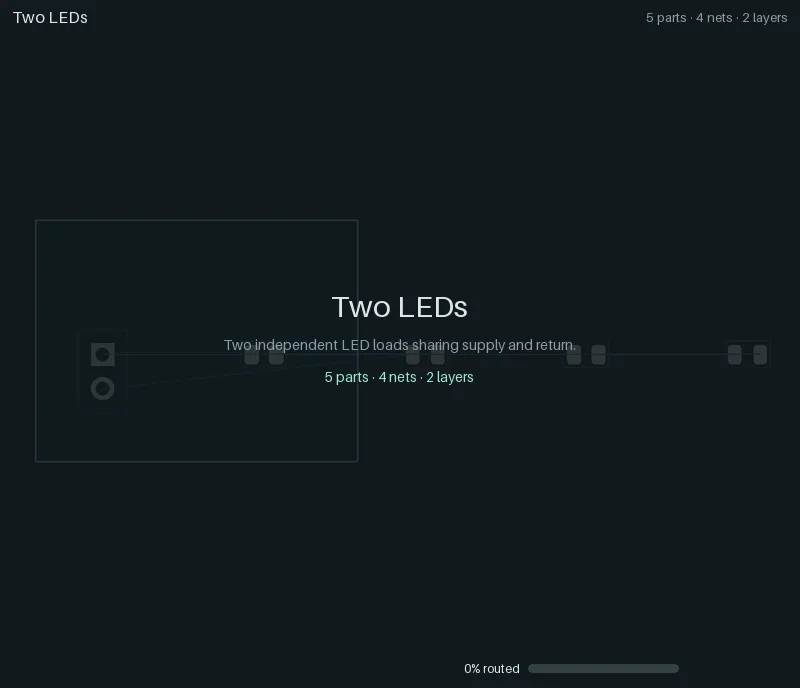
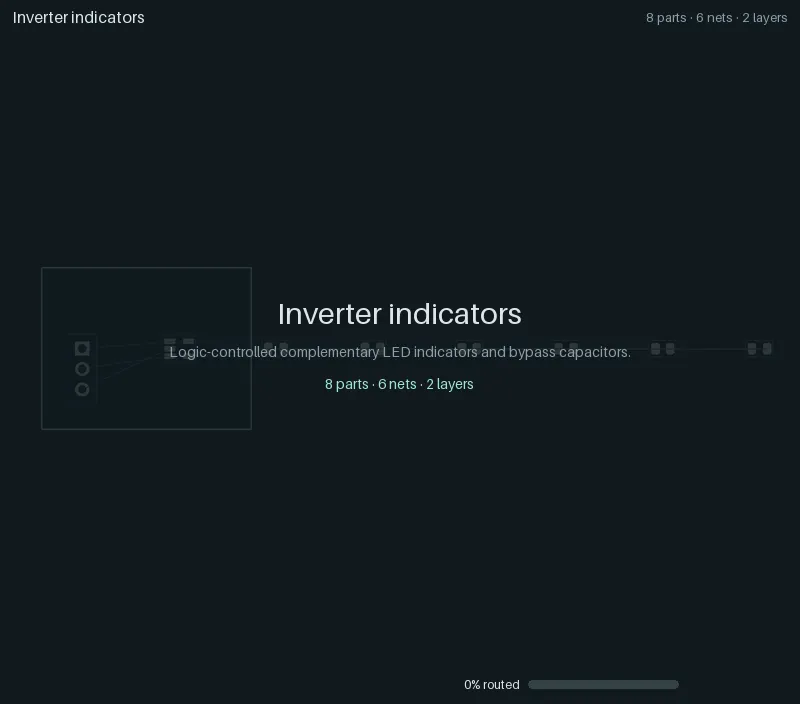
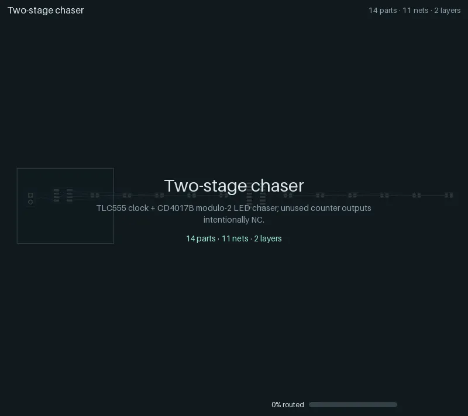
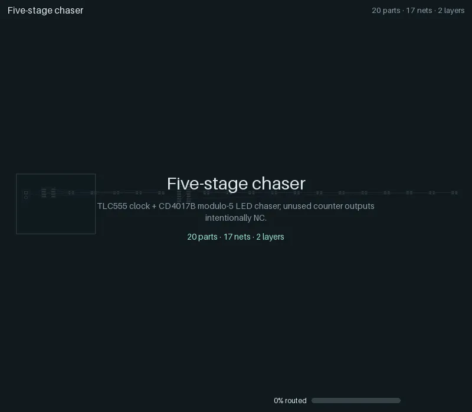
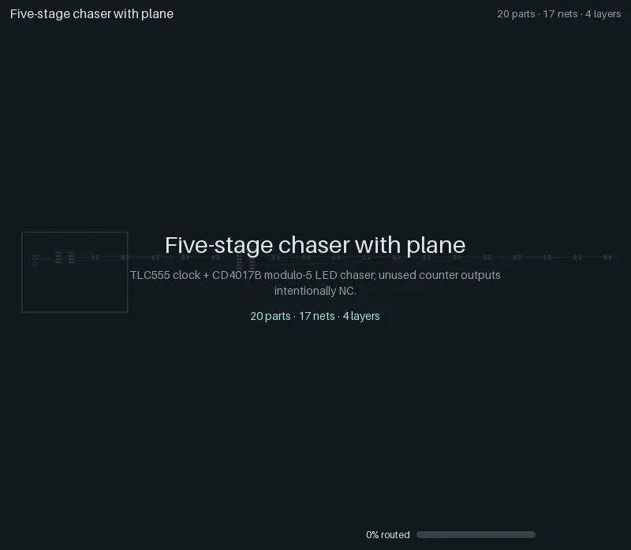

# Regression ladder

The regression ladder is yapnr's ramping-complexity test suite: eight small boards, from one LED on
a connector up to a TLC555 + CD4017B LED chaser on four copper layers. Each case starts from its
circuit alone (a netlist of real KiCad library footprints on an empty outline; only the supply
connector is fixed), runs the ordinary place-and-route pipeline, and is judged by KiCad's own
design-rule check (DRC) on the saved board. The fixtures, the runner and the frozen results of the
engine's last Splanc round live in [`hardware/pnr/regression/`][ladder-readme].

Every case below has an animation of its critical path: one straight line from the unplaced board
to the fully routed board and KiCad's verdict, including the experiments the final board descends
from and, at each selection, the candidates it was chosen from. The animations are recorded with
the runner's own defaults (ladder-v2, `docs/decisions.md`): [compact placement](#compact-placement)
(`PNR_COMPACT=1`) and the [gloss pass](#gloss) (`PNR_GLOSS=1`); `--no-compact`/`--no-gloss` turn
either off for an A/B.

> **Status (2026-10-06):** all eight cases **pass** the gate: 100 % routed, no open connections
> and no findings in KiCad's DRC, in the runner's own default configuration (compact placement,
> gloss, the initial placement pool, the engine's own JLCPCB fab profile -- the animations'
> configuration too, so docs and CI agree). The ladder routes and is judged under
> `--fab-profile jlc-pofv` (the runner's default since ladder-v2), where the router keeps vias
> 0.127 mm off SMD pads; under the fixtures' own legacy rules (`--fab-profile legacy`), every case
> passes too (other boards, below).

## The cases

Seed 0, with the runner's own defaults (the initial placement pool: 8 starts, 3 routed finalists;
compact placement; the gloss stage; the engine's JLCPCB fab profile); KiCad 10.0.6, engine
`f362d1e6` (compact placement with the legalizer parts `WIRE`, `TURN`, `SATELLITES`, `PAIRS` and
`RELAX`, and the GP-side escape-channel reservation that keeps block-level legalization from
moving much; `docs/design/compact-placement.md` sections 12 and 13). "Opens" and "findings" are
KiCad's DRC counts on the saved board; "Placed" is the bounding box of the placed parts' bodies
(`compactness` in `result.json`) on the board's outline; the time is the case's wall time on the
development Mac (darwin-arm64), niced, next to other work, gloss stage included (about 20 s of it
is a fixed overhead).

| Case                                                                | Parts | Nets | Layers | Added difficulty                                       | Routed | Opens | Findings | Vias | Copper (mm) | Placed on board (mm)   | Time (s) | Gate |
| ------------------------------------------------------------------- | ----: | ---: | -----: | ------------------------------------------------------ | :----: | ----: | -------: | ---: | ----------: | ---------------------- | -------: | ---- |
| [01 Connector + LED](#01-connector--led)                            |     2 |    2 |      2 | Basic connection; externally current-limited supply    | 100 %  |     0 |        0 |    0 |        6.95 | 5.8 × 6.2 on 18 × 14   |     20.5 | pass |
| [02 Resistor + LED](#02-resistor--led)                              |     3 |    3 |      2 | Movable series current limiter                         | 100 %  |     0 |        0 |    0 |       15.33 | 8.7 × 7.2 on 20 × 16   |     19.2 | pass |
| [03 Two LEDs](#03-two-leds)                                         |     5 |    4 |      2 | Shared, branched supply and return                     | 100 %  |     0 |        0 |    0 |       23.71 | 9.3 × 10.5 on 24 × 18  |     22.4 | pass |
| [04 Inverter indicators](#04-inverter-indicators)                   |     8 |    6 |      2 | SOT-23-5 pin escapes, an unused pad, 3-pin connector   | 100 %  |     0 |        0 |    1 |       70.43 | 11.9 × 15.0 on 26 × 20 |     28.8 | pass |
| [05 TLC555 blinker](#05-tlc555-blinker)                             |    10 |    7 |      2 | 8-pin IC, RC timing and control, bypass and bulk caps  | 100 %  |     0 |        0 |    3 |      125.34 | 15.9 × 17.6 on 30 × 24 |     32.8 | pass |
| [06 Two-stage chaser](#06-two-stage-chaser)                         |    14 |   11 |      2 | TLC555 + CD4017B, cross-IC clock and reset, fanout     | 100 %  |     0 |        0 |   11 |      219.99 | 25.4 × 17.2 on 36 × 28 |     39.8 | pass |
| [07 Five-stage chaser](#07-five-stage-chaser)                       |    20 |   17 |      2 | Five LED/resistor outputs, shared rails, dense routes  | 100 %  |     0 |        0 |   21 |      296.81 | 22.2 × 24.0 on 42 × 32 |     68.7 | pass |
| [08 Five-stage chaser with plane](#08-five-stage-chaser-with-plane) |    20 |   17 |      4 | Four copper layers, ground plane attachment and refill | 100 %  |     0 |        0 |   26 |      221.81 | 24.4 × 23.4 on 42 × 32 |     48.1 | pass |

Against the animations they replace (2026-10-03: the same configuration without the legalizer parts,
engine `cfb7cb3`, on the same Mac), the legalizer now picks each part's slot and turn with its
wirelength and turns parts in place where that shortens their wires: the copper is shorter on seven
of the eight cases (05: 113.37 to 75.14 mm, 06: 208.79 to 165.58 mm, 07: 272.90 to 220.85 mm, 08:
215.62 to 172.61 mm; 01 is unchanged) and the vias fewer (04: 4 to 2, 05: 6 to 4, 06: 11 to 6, 07:
23 to 13, 08: 29 to 27). These are single seeds; the [compact placement
design](design/compact-placement.md) (section 11) measures the parts on two seeds and the hard
rungs.

The baseline configuration (no pool, neither opt-in stage), seeds 0 and 1, as the nightly CI
lane runs it, passes all sixteen runs as well. The machine-readable results are in
<a href="animations/ladder-results.json"><code>animations/ladder-results.json</code></a>, and
the provenance of the animations (the ladder run's engine commit, `sources_sha256` over its frozen
sources, fabrication profile, platform and KiCad; the render's Pillow version; each file's trace
and content hash) is in <a href="animations/manifest.json"><code>animations/manifest.json</code></a>.

The gate (see the [ladder README][ladder-readme]) requires a legal placement, complete routing with
no deferred nets, the original pin and net assignments, tracks at their source widths, qualified SMD
pad entries, and zero KiCad unconnected items and findings, warnings included. Signal tracks are
0.25 mm, supply and return at least 0.4 mm, clearance 0.2 mm, vias 0.6/0.3 mm: the fixtures' own
fabrication block, which the runner routes and judges under (`PNR_FAB_PROFILE=legacy` for every
stage). `--fab-profile jlc-pofv` routes and judges under the engine's default JLCPCB profile
instead (0.127 mm clearance, 0.45/0.30 mm vias, vias 0.127 mm off SMD pads).

### Showcases

Four more cases show what the engine does with placement constraints and with hierarchy: the
five-stage chaser with its LEDs held in a line group, a small board with its connector, button
and LED held on the south edge (each beside a twin without the constraint), and a twin-bank
chaser placed and routed as blocks. They run through the same runner and gate, but they are not
ladder cases: they are outside the gate and the pull-request lane (the nightly lane runs them for
information). Their animations and results are on
[Constraints and hierarchy](constraints-and-hierarchy.md).

## Reading an animation

- **Header:** the case, and its parts, connected nets and copper layers.
- **Footer:** the phase and the experiment it belongs to (`start-05` is the sixth start of the
  initial placement pool), the share of connections routed, and the step within the phase. The
  number and the mint bar count committed copper (or, after writeback, KiCad's own count); while
  the router still negotiates (provisional routes, overlaps allowed), a lighter violet bar fills
  behind it.
- **Board:** front copper orange, back copper blue, inner layers violet and yellow (planes as a
  light fill), vias as rings, unrouted connections as thin grey ratsnest lines. New copper flashes
  green; ripped-up copper flashes red. A red ring marks each KiCad DRC finding, if any. Part
  outlines are the courtyards the placer keeps apart (with compact placement, offset to where
  the footprint actually lies about its origin).
- **Gloss (before and after):** with the gloss stage, the board before it shows the copper the
  stage replaces in dashed red ("Gloss: before" and the copper length), then cross-fades to the
  board after it with the new copper in green ("Gloss: after", the length and its change). Only
  copper whose geometry changed is marked: the pass also merges collinear pieces of a track, which
  leaves the copper as it was. A case whose copper the stage did not change shows "Gloss · no
  copper changed" instead.
- **Montages:** where the engine chose between experiments, the candidates appear side by side
  with their score; the chosen one is framed, and the view zooms back into it. A montage comes
  right after the winner's own replay has reached the state its tiles show, so the timeline never
  runs ahead of itself: the pool's shortlist (legal starts ranked by a capacity proxy) follows the
  chosen start's legalization, and the routed finalists follow its route.
- **The straight line:** title card, the unplaced board (footprints in the generator's row), the
  chosen start's global placement and legalization, the shortlist, detailed routing (negotiation,
  then commits), the finalists, KiCad's writeback and planes, the gloss stage's before and after,
  the zone refill, then the verdict. With feedback rounds, each round on the path follows with its
  congestion map.
- **End card:** KiCad's DRC on the saved board (mint when the gate passes, red with the rules it
  breaks when it fails), vias, copper length, seed and the number of rivals set aside.

## Animations

### 01 Connector + LED

<p></p>

Two parts, externally current limited (no onboard resistor). 2 nets, 0 vias, 6.3 mm of copper;
the LED sits beside the connector's pins (5.8 × 6.2 mm placed); the gloss stage changes no copper.
KiCad: 0 unconnected, 0 findings. **Passes.**

### 02 Resistor + LED

<p></p>

A movable series current limiter. 3 nets, 0 vias, 13.1 mm of copper (5.7 × 9.0 mm placed); the
gloss stage changes no copper. KiCad: 0 unconnected, 0 findings. **Passes.**

### 03 Two LEDs

<p></p>

Two independent LED loads sharing supply and return. 4 nets, 0 vias, 24.1 mm of copper (8.3 × 8.7 mm
placed); the gloss stage straightens one short track (0.01 mm less). KiCad: 0 unconnected, 0
findings. **Passes.**

### 04 Inverter indicators

<p></p>

Complementary LED indicators driven by an SN74LVC1G04, with bypass capacitors and one unused pad.
6 nets, 2 vias, 56.1 mm of copper (12.6 × 13.6 mm placed); gloss: 56.4 to 56.1 mm of copper.
KiCad: 0 unconnected, 0 findings. **Passes.**

### 05 TLC555 blinker

<p></p>

The 555 flasher: a TLC555 astable with timing, control and supply capacitors, and the README's
animation (also as a GIF,
<a href="animations/05-timer-led-10.gif"><code>05-timer-led-10.gif</code></a>). 7 nets, 4 vias,
75.1 mm of copper (14.1 × 15.0 mm placed); gloss: 76.5 to 75.1 mm of copper, 10 to 5 signal
bends. KiCad: 0 unconnected, 0 findings. **Passes.**

### 06 Two-stage chaser

<p></p>

A TLC555 clocking a CD4017B Johnson counter, modulo 2, with cross-IC clock and reset. 11 nets, 6
vias, 165.6 mm of copper (20.9 × 19.6 mm placed); gloss: 167.1 to 165.6 mm of copper, 26 to 12
signal bends. KiCad: 0 unconnected, 0 findings. **Passes.**

### 07 Five-stage chaser

<p></p>

The same timer and counter driving five LED and resistor outputs on two layers: the densest
two-layer board. 17 nets, 13 vias, 220.8 mm of copper (21.2 × 23.6 mm placed); gloss: 225.5 to
220.8 mm of copper, 58 to 23 signal bends. KiCad: 0 unconnected, 0 findings. **Passes.**

### 08 Five-stage chaser with plane

<p></p>

Case 07 on four copper layers, with the return on an inner ground plane (attachment and zone
refill). 17 nets, 27 vias, 172.6 mm of copper (23.1 × 20.6 mm placed); gloss: 176.5 to 172.6 mm
of copper, 56 to 30 signal bends. KiCad: 0 unconnected, 0 findings. **Passes.**

## Regenerating

The ladder needs a numerical Python (torch, NumPy, PyYAML) and KiCad 10 with its Python module and
footprint library. On macOS, use the headless KiCad copy (see
[DEVELOPERS.md](../DEVELOPERS.md#kicad)), never the application bundle; run niced on a shared
machine. The committed animations were made in two steps, a traced ladder run and a render:

```sh
# 1. The traced ladder (about 7 minutes on the development Mac); the output must not exist.
#    The fabrication profile defaults to legacy (--fab-profile); --compact and --gloss are the
#    animations' opt-in stages (recorded in each animation's config).
"$NUMERIC_PYTHON" hardware/pnr/regression/run.py --repo . --out .yapnr/ladder/RUN --seed 0 \
  --trace --initial-pool --initial-starts 8 --initial-finalists 3 --compact --gloss \
  --python "$NUMERIC_PYTHON" --kicad-python "$PNR_KICAD_PYTHON" \
  --kicad-cli "$PNR_KICAD_CLI" --library "$PNR_KICAD_FOOTPRINTS"

# 2. Render every case into docs/animations/ (WebP, the README GIF, manifest.json and
#    ladder-results.json); no KiCad needed. --allow-failed also renders failed cases (their end
#    card names the broken rules in red).
bazel run //hardware/pnr:ladder_animations -- --render-only "$PWD/.yapnr/ladder/RUN"
```

`bazel run //hardware/pnr:ladder_animations` without `--render-only` does both (pass `--python`,
`--kicad-python`, `--kicad-cli` and `--library`, and `--runner-arg=--compact --runner-arg=--gloss`
for the committed configuration); it reruns a case that fails in pool mode in the baseline
configuration (with `--fallback-runner-arg=--gloss`, without compact placement). One case, or
another trace, renders with `bazel run //hardware/pnr:animate -- SOURCE --out FILE.webp`
(`python -m pnr.animate`; `.gif` and, with `ffmpeg`, `.mp4` work too). `.yapnr/` is
git-ignored: only the rendered animations and the two JSON files are committed.

`pnr.animate` also takes the output directory of a successive-halving search (`pnr.mc.halving`).
Such a run records no trace, so its animation is reconstructed from what it saved (the overlay
does not claim more): the winner's placement moving in from the source board, a montage per
promotion (the candidates' placements with their rung objective), the winning rung's native
phases (`phases/NN-name/diagnostic.kicad_pcb` with each phase's KiCad DRC) and a montage of that
rung's final boards, then the verdict. Blocks assembled from a synthesis library appear in place;
a library itself has no board to draw, and `--storyboard FILE` writes its critical path (the
chosen layout per template and its rivals) instead. The animator only reads its sources.

Rendering is deterministic: the same trace gives the same bytes. Renderer 3 (the manifest's
`renderer`) adds the gloss stage's before and after; a trace without the stage renders as
before. Budgets: the ladder's WebPs at most 2.5 MB (800 px), its README GIF at most 5 MB
(640 px), the folder at most 30 MB with the showcases, whose own widths and budgets are on
[Constraints and hierarchy](constraints-and-hierarchy.md#regenerating)
(`tests/unit/repo/test_animations.py` checks them all). Refresh the committed animations
deliberately, after a notable engine change, not on every pull request: each refresh adds about
12 MB to the history.

## Gloss

`run.py --gloss` adds one stage after the refill: the gloss, dekink and corridor-coalescing pass
(`PNR_GLOSS`, on by default since ladder-v2, `docs/decisions.md`; `--no-gloss` restores the plain
runner path; [design](design/gloss.md)), with the semantics of the native loop's `07g-gloss` pass,
gated inside the pass by native checks and a cold KiCad DRC, and again by the runner's own DRC (a
worse DRC restores `routed.pre-gloss.kicad_pcb`). `--gloss-flag PNR_GLOSS_NAME=VALUE` passes
sub-flags, and `--gloss-measure` measures every final board, for both arms of an A/B.

A/B of 2026-10-03 (Mac) and 2026-10-05 (GCP, the native-loop A/B that unblocked the default):
the eight cases and the four showcases, seeds 0 and 1, one engine for both arms, legacy profile:

```sh
run.py ... --seed 0 --seed 1 --showcases --no-gloss --gloss-measure    # off
run.py ... --seed 0 --seed 1 --showcases --gloss --gloss-measure       # on
```

Every on-arm case pairs with its off-arm twin (the same placement, routes and pre-gloss copper,
`copper_sha256`). "Length" and "Bends" are the eligible signal copper (`Default` netclass, signal
width) and every degree-2 vertex on it; X is the summed excess gap to same-class neighbours within
2 mm (smaller is tighter) and DS the free area no signal track can use. Transactions are accepted
of proposed. "Gloss" is the stage's wall and CPU time with its two cold DRCs; "Case CPU" is the
whole case's CPU time without `--gloss-measure`, which both arms run.

| Case               | Seed | Gate off / on | Opens, findings |   Length (mm) |     Bends |     X (mm²) |    DS (mm²) | Transactions | Gloss wall / CPU (s) | Case CPU off / on (s) |
| ------------------ | ---: | ------------- | --------------- | ------------: | --------: | ----------: | ----------: | -----------: | -------------------: | --------------------: |
| 01-connector-led-2 |    0 | pass / pass   | 0, 0 → 0, 0     |           4.6 |         3 |         0.0 |        0.03 |       1 of 1 |              12 / 29 |                9 / 38 |
| 01-connector-led-2 |    1 | pass / pass   | 0, 0 → 0, 0     |           4.6 |         3 |         0.0 |        0.03 |       1 of 1 |              12 / 29 |                9 / 38 |
| 02-resistor-led-3  |    0 | pass / pass   | 0, 0 → 0, 0     |           3.7 |         5 |         0.0 |        0.21 |       1 of 1 |              12 / 29 |                9 / 38 |
| 02-resistor-led-3  |    1 | pass / pass   | 0, 0 → 0, 0     |     6.7 → 5.9 |     9 → 5 |         0.0 | 0.32 → 0.09 |       3 of 3 |              18 / 40 |                9 / 50 |
| 03-branched-leds-5 |    0 | pass / pass   | 0, 0 → 0, 0     |   10.2 → 10.1 |    12 → 9 |         0.0 |        0.17 |       2 of 2 |              15 / 34 |                9 / 44 |
| 03-branched-leds-5 |    1 | pass / pass   | 0, 0 → 0, 0     |           8.2 |        10 |         0.0 |        0.10 |       1 of 1 |              11 / 29 |               10 / 39 |
| 04-inverter-leds-8 |    0 | pass / pass   | 0, 0 → 0, 0     |   35.6 → 35.0 |   33 → 26 |   4.0 → 6.3 | 0.52 → 0.46 |       3 of 3 |              16 / 41 |               12 / 53 |
| 04-inverter-leds-8 |    1 | pass / pass   | 0, 0 → 0, 0     |   38.3 → 37.3 |   40 → 27 |         0.0 | 0.66 → 0.57 |       5 of 5 |              20 / 52 |               13 / 65 |
| 05-timer-led-10    |    0 | pass / pass   | 0, 0 → 0, 0     |   47.4 → 45.7 |   59 → 41 |   0.8 → 0.6 | 2.01 → 1.90 |       4 of 5 |              21 / 48 |               15 / 63 |
| 05-timer-led-10    |    1 | pass / pass   | 0, 0 → 0, 0     |   69.6 → 65.8 |   67 → 44 |   6.8 → 4.4 | 2.12 → 1.20 |       8 of 8 |              30 / 71 |              49 / 122 |
| 06-chaser-14       |    0 | pass / pass   | 0, 0 → 0, 0     | 150.7 → 144.7 |  113 → 85 | 34.6 → 21.2 | 2.29 → 2.62 |       7 of 7 |              31 / 71 |              31 / 102 |
| 06-chaser-14       |    1 | pass / pass   | 0, 0 → 0, 0     | 113.5 → 111.6 |   91 → 65 | 13.3 → 14.3 | 2.98 → 2.49 |       6 of 6 |              24 / 60 |               37 / 96 |
| 07-chaser-20       |    0 | pass / pass   | 0, 0 → 0, 0     | 231.8 → 220.0 | 191 → 130 |  20.8 → 9.7 | 3.93 → 3.88 |     10 of 10 |              41 / 92 |              49 / 142 |
| 07-chaser-20       |    1 | pass / pass   | 0, 0 → 0, 0     | 217.8 → 206.6 | 180 → 120 | 52.1 → 38.7 | 4.59 → 2.98 |     13 of 14 |             55 / 114 |             115 / 231 |
| 08-chaser-20-plane |    0 | pass / pass   | 0, 0 → 0, 0     | 231.7 → 226.9 | 171 → 127 | 37.4 → 25.1 | 4.74 → 3.82 |     13 of 13 |             46 / 107 |              82 / 188 |
| 08-chaser-20-plane |    1 | pass / pass   | 0, 0 → 0, 0     | 248.3 → 237.0 | 192 → 110 | 45.6 → 22.1 | 4.98 → 2.78 |     15 of 15 |             53 / 121 |             198 / 315 |
| edge-io-12         |    0 | pass / pass   | 0, 0 → 0, 0     |   93.0 → 89.6 |   90 → 53 |   9.5 → 3.8 | 1.51 → 1.25 |       6 of 6 |              25 / 61 |               21 / 81 |
| edge-io-12         |    1 | pass / pass   | 0, 0 → 0, 0     |   94.7 → 91.0 |   94 → 61 | 19.0 → 14.1 | 1.55 → 1.31 |     10 of 10 |              38 / 85 |              38 / 122 |
| edge-io-12-free    |    0 | pass / pass   | 0, 0 → 0, 0     |  100.1 → 95.6 |   82 → 52 | 18.7 → 21.5 | 1.77 → 1.67 |       8 of 8 |              29 / 72 |              32 / 105 |
| edge-io-12-free    |    1 | pass / pass   | 0, 0 → 0, 0     |   94.4 → 90.9 |   82 → 43 | 13.8 → 11.8 |        1.58 |       9 of 9 |              30 / 76 |               22 / 98 |
| hier-twin-bank-32  |    0 | pass / pass   | 0, 0 → 0, 0     | 323.9 → 307.8 | 279 → 210 | 66.1 → 54.5 | 8.56 → 5.21 |       7 of 7 |              45 / 84 |             213 / 296 |
| hier-twin-bank-32  |    1 | pass / pass   | 0, 0 → 0, 0     | 307.4 → 294.3 | 271 → 202 | 63.2 → 58.4 | 8.71 → 6.14 |       7 of 7 |              42 / 83 |             224 / 305 |
| line-chaser-20     |    0 | pass / pass   | 0, 0 → 0, 0     | 235.8 → 227.4 | 188 → 125 | 34.2 → 32.6 | 3.57 → 3.26 |     10 of 10 |              39 / 90 |              58 / 147 |
| line-chaser-20     |    1 | pass / pass   | 0, 0 → 0, 0     | 184.3 → 177.6 |  162 → 96 | 20.8 → 10.4 | 3.22 → 3.17 |       6 of 6 |              30 / 67 |              35 / 102 |

- **No regression:** all 24 runs pass the gate in both arms; KiCad's opens and findings (0 and 0
  everywhere), the objective vector and the audit are unchanged. The runner's outer gate never
  fired, no pass reverted at its end gate and none stopped on a budget.
- **Bends -32 %** in total (2427 to 1652; 0 to -48 % per run), **length -4.0 %** (2856.3 to
  2741.9 mm; never up), X -24 % in total and DS -22 %. X rose on three runs and DS on one: the
  router's cost ranks first, and a shortcut that saves at least 0.2 mm is kept even when it moves
  a track off its neighbour.
- **The legalizer at work:** 156 of 158 transactions accepted; the trial worker dropped the other
  two edits on the applied board (a new same-net contact, `L2`, and a corridor member whose
  segments an earlier transaction had replaced). Edits: normalize 281, dekink 162, gloss 185,
  corridor 18.
- **Cost:** the stage takes 11 to 55 s of wall time and 29 to 121 s of CPU per case, a roughly
  fixed overhead (KiCad worker start-up and the cold DRCs dominate on these small boards). In all,
  the on arm used 2880 s of CPU against 1301 s (2.2 times) and 1918 s of wall time against 1226 s
  (+56 %). Per case the CPU factor falls with the case's size: 2.5 to 5.4 on cases 01 to 05, 3.2
  to 4.4 on the edge-io showcases, 1.6 to 3.3 on the chaser cases and 1.4 on hier-twin-bank-32.
- **Against the first A/B** (engine `879f22c`, before the ray metric stopped depending on the
  drawing direction): the off arm's copper is the same on all 24 runs; 21 of the 24 on-arm runs
  keep the same copper, and three take a different equal-cost edit (length within 0.1 mm, the same
  bends). X counts a few more samples now (a ray through a neighbour's vertex counts the
  neighbour), so its values are not comparable with the first A/B's.
- **Functional groups** (first A/B): 07-chaser-20 with the example groups file
  (`docs/examples/gloss-groups-chaser.json`) and the groups derived from the rules gives the same
  copper as without groups (longest cross-group run at minimum pitch 0 and 1.5 mm, under the
  10 mm cap).
- **Determinism:** the off arm repeats the first A/B's copper on all 24 runs, and a rerun of
  04-inverter-leds-8 and 07-chaser-20 (seed 0) with the gloss stage gave the same copper; only the
  direction in which a few merged segments are drawn differed (1 and 4 segments), which
  `copper_sha256` and the metrics ignore.

The ladder runs the pass after a complete route, so it cannot show whether the pass helps or
hurts completion; turning it on by default waits for a paired A/B of the native loop.

## Compact placement

`run.py --compact` places with `PNR_COMPACT=1` (on by default since ladder-v2, `docs/decisions.md`;
`--no-compact` restores the pre-ladder-v2 runner path; [design](design/compact-placement.md)):
spread 1.0 and starts clustered around the fixed parts, the courtyard gap instead of the routing
clearance in the legalizer (with a copper margin only where a part's box hugs its pads), offset
courtyards (a pin-1-origin header occupies its real extent), a compactness tie-break after
every completion key and the vias, and the plane drops of a `plane_layer` net without a declared
stack planned before routing, and the legalizer parts of the design's section 11: the
wirelength term with the turn chosen with the slot, in-place turns, and line satellites.
`--compact-off PART` drops one part (`GP`, `RANK`, `LEGALIZE`, `COURTYARD`, `DROPS`, `WIRE`,
`TURN`, `SATELLITES`, `PAIRS`, `RELAX`) for an ablation. `PAIRS` lets the matched-length pass turn
a pair's series parts to face their legs; `RELAX` runs every round after one that does not route
(a net open or a pair out of skew) without compact, the first of them as the run without compact
does ([design, section 12](design/compact-placement.md)). `--shrink` (`PNR_SHRINK=1`) also
searches a smaller outline inside the design's and writes the board at the smallest that routes;
hard rungs are exempt. Both are recorded in `provenance.json` (`pnr_environment`).

The legalizer and global-placement switches of the [design's section 11](design/compact-placement.md)
are runner options too, off by default and usable with or without `--compact`: `--gp-polish`,
`--gp-channels L`, `--pool-source-clamp`, `--legalize-hpwl W`, `--legalize-reorient [wire]`,
`--legalize-channel-clearance fab` and `--line-satellites` (`PNR_GP_POLISH`, `PNR_GP_CHANNELS`,
`PNR_POOL_SOURCE_CLAMP`, `PNR_LEGALIZE_HPWL`, `PNR_LEGALIZE_REORIENT`,
`PNR_LEGALIZE_CHANNEL_CLEARANCE`, `PNR_LINE_SATELLITES`, recorded in `provenance.json` like the
others).

Every case's `result.json` gains `compactness`, measured alike in every arm on the parts' body
boxes in `placed.json`: the bounding box (`bbox_mm2`, `bbox_mm`), the summed body area,
`utilization` (area over bbox), `occupancy` (area over the outline) and the outline area.

```sh
run.py ... --seed 0 --seed 1 --showcases --gloss-measure --no-compact         # off
run.py ... --seed 0 --seed 1 --showcases --gloss-measure --compact            # compact
run.py ... --seed 0 --seed 1 --showcases --gloss-measure --compact --shrink   # and shrink
```

The animation scripts pass such options with `--runner-arg` (for example
`animate_ladder.py ... --runner-arg=--compact --runner-arg=--gloss`, now the runner's own
defaults) and record them in each animation's `config`; `--fallback-runner-arg` gives
`animate_ladder.py`'s baseline fallback its own (`--fallback-runner-arg=--no-compact` reruns a
failed compact case without it). The committed animations use the runner's own defaults, which
_are_ `--compact --gloss` (see [The cases](#the-cases)).

Results (2026-10-03, GCP C4D x86-64, seeds 0 and 1): with `--compact` the eight cases and four
showcases all pass (with and without gloss), as do `09-mcu-usb-31-header` (whose pool fails
without it), `08-chaser-20-plane` on seeds 0 to 9 (7 of 10 without it) and the 14 nightly hard
rungs; the summed placed bounding box of the 24 ladder cells drops from 13068 to 8122 mm² and
their copper from 4777 to 4022 mm, for 28 more vias. It stays off by default because 5 of the 16
manual `09-mcu-usb-31` rung cells had with it at the time (see the
[design](design/compact-placement.md) section 12): `RELAX` (every round after one that does not
route falls back to the plain packer) and `PAIRS` (the matched-length pass may turn a pair's
series parts to face their legs) fixed the lane without losing the rest of the gain, so ladder-v2
(`docs/decisions.md`) made `--compact` the runner's own default.

## In CI

`.github/workflows/ladder.yaml` runs the ladder inside the published arm64 image: cases 01 to 06
with seed 0 on pull requests that change engine inputs, and nightly all eight cases with seeds 0
and 1, under the runner's own defaults (ladder-v2: compact, gloss, the initial placement pool,
coupled diff-pair routing, the jlc-pofv fab profile) and traced -- one configuration, which both
decides the job and feeds the animations job, so docs and CI agree. Its animations are uploaded
as an artifact and its trace hashes are compared with
<a href="animations/manifest.json"><code>animations/manifest.json</code></a> (a drift is a
notice). The showcases run the same defaults, traced. The lane is informational, not a required
check yet; its aggregate check is named `ladder`.

[ladder-readme]: https://github.com/Studio-Fug/yapnr/blob/main/hardware/pnr/regression/README.md
